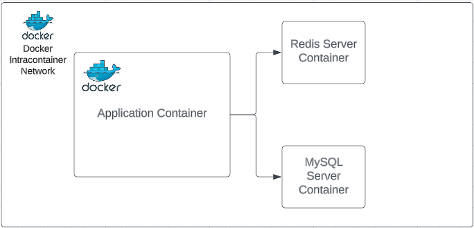
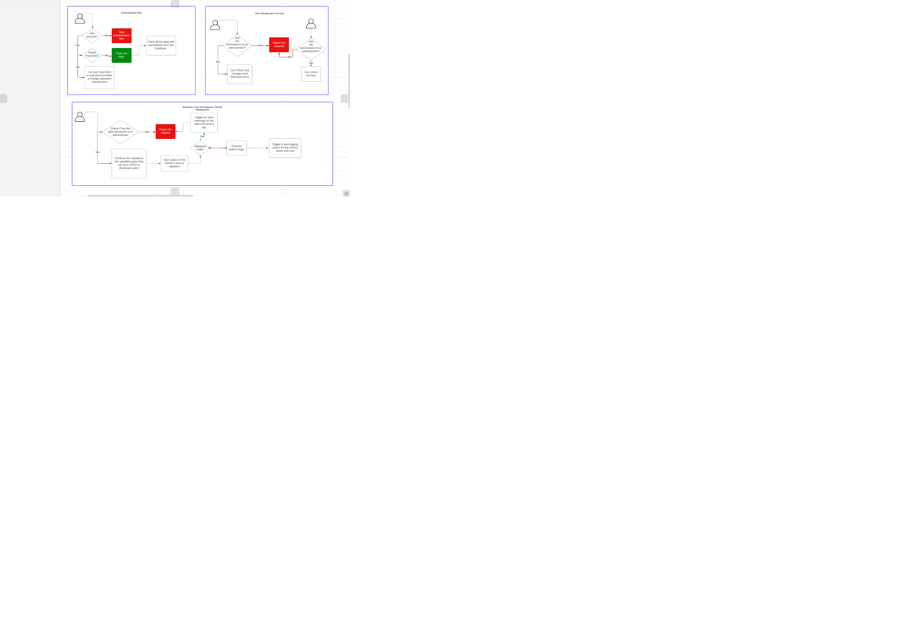

### Autopark

Autopark is a web application that can help you to get started with your own digitalization of your company and employees that are using the comapny's autovehicles to go from a location to other.
Autopark was built with a nice UI and UX and use a friendly approach to generate reports and statistics on the data that you are using.

---
## Getting started how to use Autopark in local envoirnment
### Requirements

The application is containerized to work in a propper envoirnement the container script can be found inside the docker-composer.yml file. In order to build the project you will need to have the following steps reproduced: 

- First install PHP dependencies using the composer in a temporary docker container using Laravel Sail
```
docker run --rm \
    -u "$(id -u):$(id -g)" \
    -v $(pwd):/opt \
    -w /opt \
    laravelsail/php74-composer:latest \
    composer install --ignore-platform-reqs
```
- After that ensure that you have all the specs from the docker-compose.yml **Networking** inside the .env file, such as addresses to the MySQL database connection, Redis Server (not needed locally), etc...
- To start the application you will need to build the images of the containers and start them using this command:
``./vendor/bin/sail up -d``
- **IMPORTANT!!! USE JUST ``./vendor/bin/sail artisan/composer/npm``** for each new action (dependency removal, installment, etc...). You don't need to have them installed locally.

### Database

The application's database can be found in the ```database/migrations``` folder to build the actual structure of the database please use the ``./vendor/bin/sail artisan migrate:fresh``.
To populate the database you can write custom seeders.
---
## Application diagrams

### Docker container networking diagram


### Application workflow diagram


---
## User stories

### Roles defined
We define two roles **administrator** and **basic** and **guest** which permissions can be updated by the administrator.

- As a guest I shall login to an account before accessing the platform.
- As a guest I can recover my account if I lost the credentials to it.
- As an administrator I need to be able to create new users, update the existing user's information and permissions, delete the existing user's.
- As an administrator I need to check other basic or administrator users actions with logs.
- As an administrator or basic user with required permission I am able to view, insert a new employee, or deactivate (soft delete) current ones.
- As an administrator or basic user with required permission I am able to view, insert a new automobile, delete an automobile, etc...
- As an administrator or basic user with required permission I am able to view, insert or delete a location that an employee can travel to.
- As an administrator or basic user with required permission I am able to create a new departure ticket, check the existing ones or download the generated ticket file.
- As an administrator or basic user with required permission I should be able to see a table with all the automobiles and their statistics.
- As an administrator or basic user with required permission I should be able to download this report in a Excel format.
